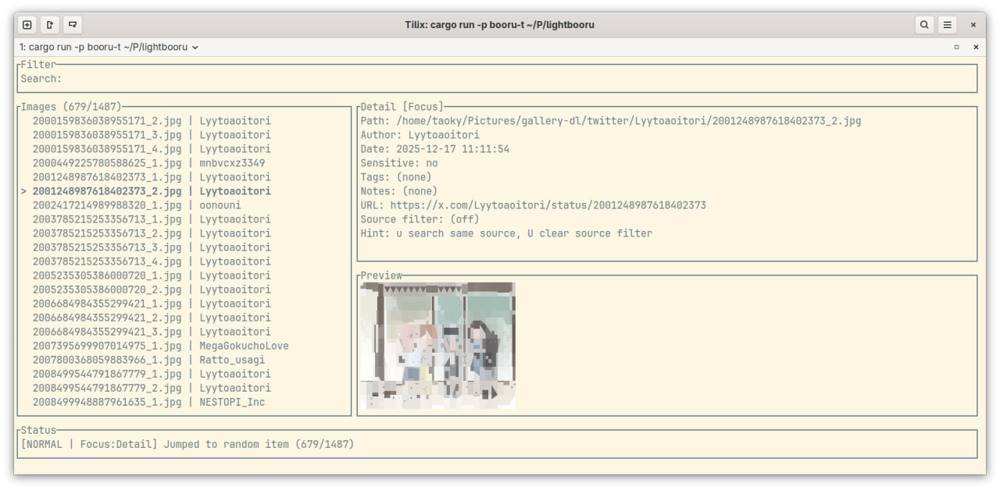
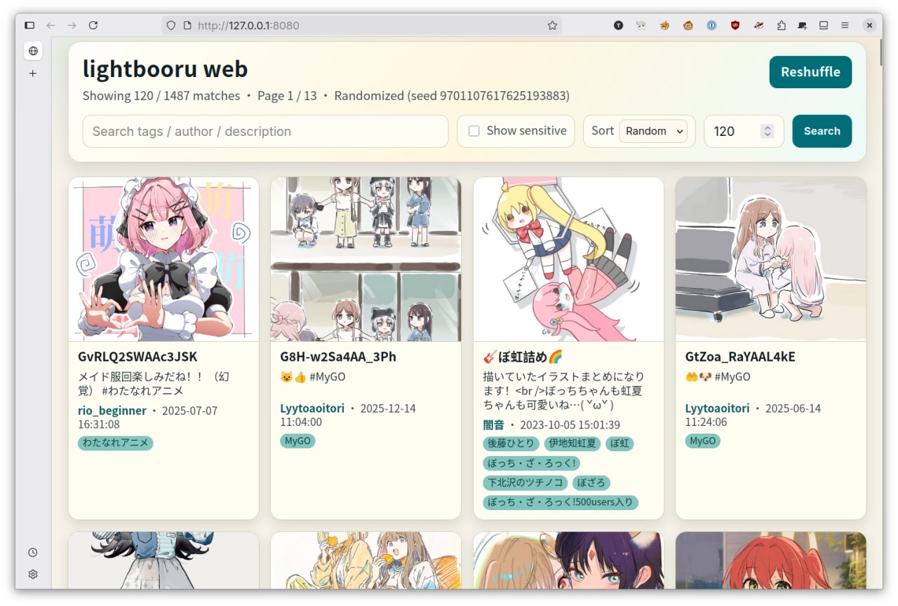
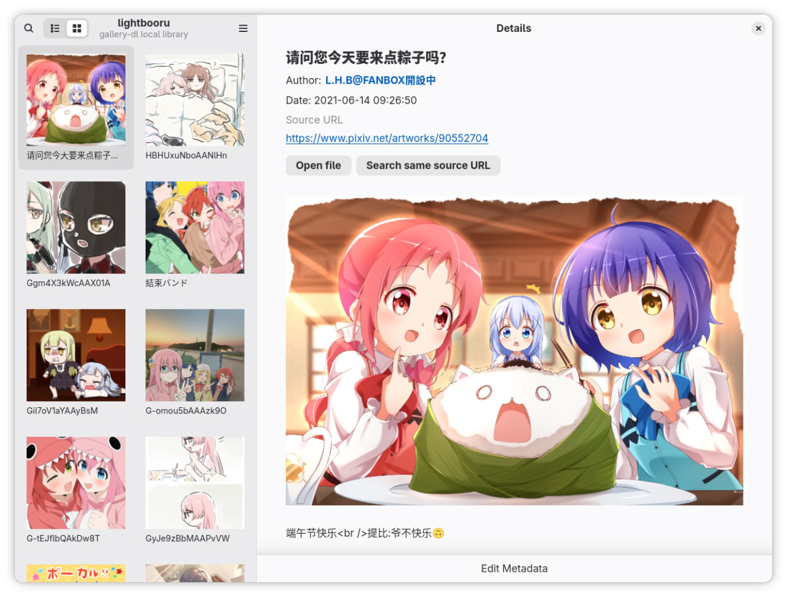

# lightbooru

A lightweight image board software, just based on files and metadata downloaded by `gallery-dl`.

This project is assisted by codex with human in the loop.

## Configuring `gallery-dl`

An example fish function:

```fish
function get_gallery
    pushd ~/Pictures/
    gallery-dl -v --cookies-from-browser firefox --write-metadata $argv
    popd
end
```

Bash one:

```bash
function get_gallery {
    pushd ~/Pictures/
    gallery-dl -v --cookies-from-browser firefox --write-metadata "$@"
    popd
}
```

Note that lightbooru, by default, scans `~/Pictures/gallery-dl/`.

## Build

```sh
cargo build -p booru-tui --release
cargo build -p booru-web --release
cargo build -p booru-gtk --release
```

## Screenshot






